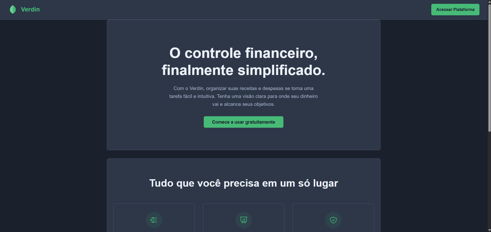

  <h1>Hi, I'm Eduardo 👋</h1>
  <h3>A student passionate about technology and creative solutions.</h3>

  
  
  

---

### About Me

* 🔭 I’m currently focused on the Verdin project.
* 👯 I’m looking to collaborate on projects involving Backend with Python.
* 💬 Ask me about: software development, best practices, or anything from the tech universe!

---

### 🎯 Current Focus

  
Currently, I'm deepening my knowledge of <strong>React</strong> and reactive UI development by applying concepts to hands-on projects.

  

---

### 🚀 Technologies & Tools

  
  
  
  
  
  
  

  
  
  
  
  
  

---

### 📊 GitHub Stats

---

### 💻 Métricas de Codificação (WakaTime)

---

### ⚡ My Recent Activity

---

### 📌 Featured Project

**Verdin Project**
*A Full-Stack personal finance management website focused on a clean user experience and robust back-end features.*
  

  
  &nbsp;
  

 

*Technologies: `HTML`, `CSS`, `TypeScript`, `Express`, `Node.js`, `PostgreSQL`*

---

### ☕ Hobbies & Interests

  <table align="center">
    <tr>
      <td align="center">📚 Reading</td>
      <td align="center">🎮 Gaming</td>
      <td align="center">🎬 Series & Movies</td>
    </tr>
    <tr>
      <td align="center">⛰️ Hiking</td>
      <td align="center">🐾 Pets</td>
      <td align="center">🎵 Music</td>
    </tr>
     <tr>
      <td align="center" colspan="3">✈️ Traveling and enjoying life!</td>
    </tr>
  </table>

 
